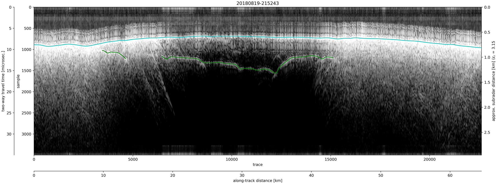

# RAGU
## Radar Analysis Graphical Utility
### Authors: Brandon Tober and Michael Christoffersen
[](https://zenodo.org/badge/latestdoi/193940796)

<!-- <p align="center">
  <br>
  RAGU logo artist: Eric Petersen<br><br>
  
</p> -->

## Description
RAGU is an open source GUI package developed to interpret radar sounding data, written in Python 3.

### Dataset Capabilities:
RAGU was originally developed to work with NASA's Operation IceBridge Alaska radar sounding data. The dataset capabilities have since been expanded to include the following:

- NASA OIB-AK
- SHARAD (USRDR, USGEOM, US clutter sims)
- MARSIS (JPL multilook products)
- GSSI
- pulseEKKO

### File Info
- *ragu_env.yml* contains a list of RAGU dependencies
- *config.ini* contains user-specified configuration file paths and information necessary to run the RAGU app
- *main.py* is run to start the RAGU app
- *ui/gui.py* handles the graphical user-interface and sets up the app
- *ui/impick.py* handles profile-view, radargram image picking
- *ui/wvpick.py* handles waveform-view picking optimization
- *ui/basemap.py* handles the basemap
- *radar/* contains radar data object information
- *radar/processing.py* performs simple user-specified radar data processing
- *ingest/* hadnles radar data ingest
- *nav/navparse.py* is used to parse radar gps data into the appropriate format and perform any necessary coordinate transformations
- *nav/gps.py*  is used to read and parse raw gps nmea strings into the appropriate format
- *tools/utils.py* contains a set of utility functions utilized by the app
- *tools/constants.py* contains uglobal constants

### Outputs
##### Pick files 
A csv text file and an ESRI shapefile may be exported containing the following information for each trace in the input radar data:
- <ins>trace</ins>: trace number  
- <ins>lon</ins>: longitude  
- <ins>lat</ins>: latitude  
- <ins>alt</ins>: altitude  
- <ins>gndElev</ins>: ground elevation  
- <ins>srfIdx</ins>: surface return sample number
- <ins>srfTwtt</ins>: two way travel time to the surface return  
- <ins>srfAmp</ins>: surface return amplitude  
- <ins>subsrfIdx</ins>: subsurface return sample number
- <ins>subsrfTwtt</ins>: two way travel time to the picked subsurface return  
- <ins>subsrfAmp</ins>: subsurface return amplitude  
- <ins>subsrfElev</ins>: subsurface return elevation  
- <ins>thick</ins>: layer thickness (ground elevation - subsurface elevation)  

##### Figure
A figure may also be exported displaying any completed picks. Example over Malaspina Glacier, AK:  
<p align="center">
  <br>
</p>

## Running RAGU

### System Requirements
Supported Operating Systems:
- Linux (tested on Ubuntu 18.04, 20.04)
- Windows (tested on Windows 10)
- Mac (tested on Catalina)

### Dependencies
- tkinter
- matplotlib
- numpy
- scipy
- pandas
- geopandas
- pyproj
- rasterio
- h5py

To create a conda environment with the required dependencies, run the following command:
```
$ conda env create -f ragu_env.yml
```
### Setup
1. Prior to running RAGU, set appropriate data paths, data coordinate reference system, and output preferences in *config.ini*. **Path variables may be left blank, but must remain uncommented**.
```
### config.ini ###
[param]
# str uid: user id 
uid = uid

[path]
# str datPath: data directory path
datPath =
# str simPath: clutter simulation directory path
simPath =
# str mapPath: basemap directory path
mapPath =
# str outPath: output directory path
outPath =

[nav]
# str body: planetary body from which radar data was acquired
body = mars
# str navcrs: crs string
crs = +proj=longlat +a=3396190 +b=3376200 +no_defs

[output]
# float eps_r: relative permittivity (dielectric constant), required for plotting in depth and calculating layer thickness
eps_r = 3.15
# bool amp: export pick amplitudes
amp = True
# bool csv: export csv file of picks
csv = True
# bool shp: export shapefile of picks
shp = True
# bool fig: export profile image with picks
fig = True
```

2a. Activate RAGU anaconda environment - 'ragu' by default:
```
$ conda activate ragu
(ragu)$ python main.py
```

2b. If the default Python environment is not set as Python 3, specify:
```
$ python3 main.py
```

## Notes
### Future Development
Additional dataset ingesters:
- Segy

Processing:
- gain
- filtering
- migration


Tools:
- depth conversion
- dielectric extraction
- pick amplitude tracking


### Desktop Shortcut
If desired, pyshorcuts can be used to create a desktop shortcut:

If not already installed, install pyshortcuts:
```
$ pip install pyshortcuts
```

Use pyshortcuts to setup desktop shortcut (make sure RAGU conda environment is activated - 'ragu' by default):
```
$ conda activate ragu
(ragu)$ pyshortcut -n RAGU -i ~/RAGU/recs/RAGU.ico ~/RAGU/code/main.py
```

On Ubuntu, add the following line to your .desktop file (located in ~/.local/share/applications) to handle duplicate instances:
```
StartupWMClass=Tk
```
