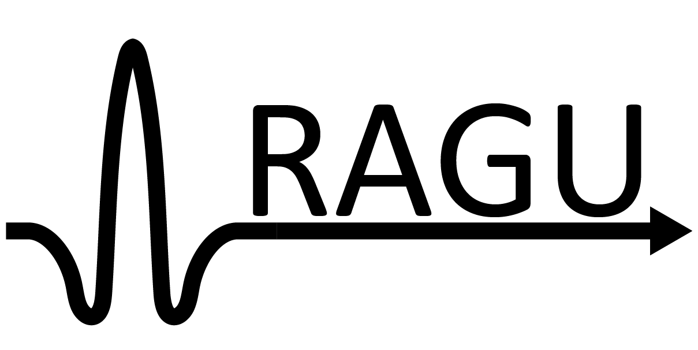
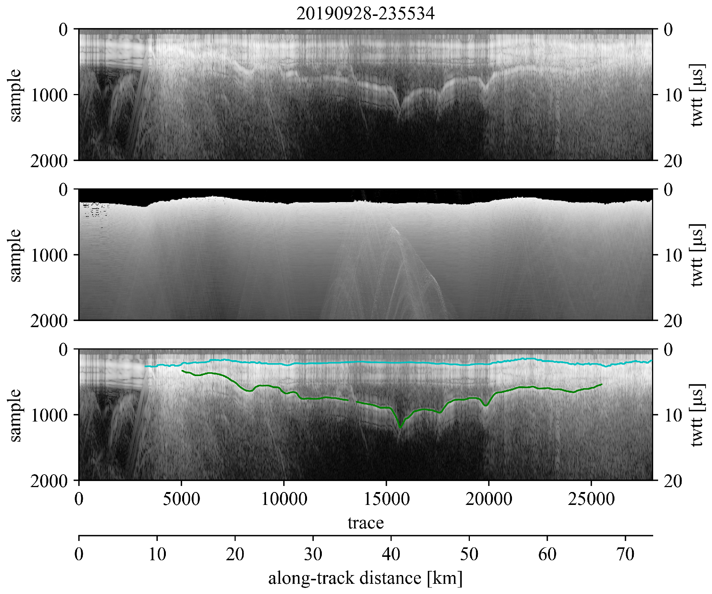

# Radar Analysis Graphical Utility
### Authors: Brandon Tober and Michael Christoffersen
[](https://doi.org/10.5281/zenodo.3968981)

## What is RAGU?
RAGU is a user-interface radar interpretation software written in Python 3 and released under the GNU General Public License v3. RAGU was originally developed to ingest and interpret NASA Operation IceBridge airborne radar sounding data, but has been expanded for use with other sounder and ground penetrating radar datasets. While RAGU is primarily an interpretation software, minimal radar processing tools are included with the software.

### Dataset Capabilities:
RAGU was originally developed to work with NASA's Operation IceBridge Alaska radar sounding data. The dataset capabilities have since been expanded to include the following:

- NASA OIB-AK
- CReSIS (Radar Depth Sounder & Snow Radar)
- SHARAD (USRDR, USGEOM, US clutter sims)
- MARSIS (JPL multilook products)
- KAGUYA (SELENE) Lunar Radar Sounder (LRS)
- GSSI
- pulseEKKO

Have another radar dataset you'd like to be able to use RAGU to interpret? Please feel free to send the necessary python code to read in the data and we can incorporate an ingester. Or, feel free to collaborate and create an ingester for reading your data type with RAGU. Follow the ingester template: - *ingest/ingest_template.py*

### Package overview
- *ragu.yml* contains a list of RAGU dependencies
- *config.ini* contains user-specified configuration file paths and information necessary to run the RAGU app
- *main.py* is run to start the RAGU app
- *ui/gui.py* handles the graphical user-interface and sets up the app
- *ui/impick.py* handles profile-view, radargram image picking
- *ui/wvpick.py* handles waveform-view picking optimization
- *ui/basemap.py* handles the basemap
- *ui/notepad.py* handles the notepad
- *radar/* contains radar data object information
- *radar/processing.py* performs simple user-specified radar data processing
- *ingest/* hadnles radar data ingest
- *nav/navparse.py* is used to parse radar gps data into the appropriate format and perform any necessary coordinate transformations
- *nav/gps.py*  is used to read and parse raw gps nmea strings into the appropriate format
- *tools/utils.py* contains a set of utility functions utilized by the app
- *tools/constants.py* contains global constants

### Outputs
#### Pick files:
1. **Comma-Separated Value (.csv)**
2. **Geopackage (.gpkg)**

    For **CSV** and **Geopackage** files, see the [format file](https://github.com/btobers/RAGU/blob/master/docs/RAGU_pk_format.pdf) in for per trace export attribute information.

#### Figure:
A figure each may also be exported for the uninterpreted radar profile, the accompanying clutter simulation, and the interpreted radar profile. Example over Malaspina Glacier, AK:  
<p align="center">
  <br>
</p>

#### Processing Script:
A file log/processing script may also be exported to keep track of and easily repeat any data processing steps. Example processing script:
```
### RAGU processing log ###
import sys
# change dir to RAGU code directory
sys.path.append('/home/user/code/RAGU/code')
from ingest import ingest

igst = ingest("/home/user/data/ARES/20140524-200130.h5")
rdata = igst.read("","+proj=longlat +ellps=WGS84 +datum=WGS84 +no_defs","earth")
rdata.lowpass(order=5, cf=1250000.0)
rdata.tpowGain(power=1.2)
```

## Running RAGU

### System Requirements
Supported Operating Systems:
- Linux (tested on Ubuntu 18.04, 20.04)
- Windows (tested on Windows 10)
- Mac (tested on Catalina)

### Dependencies
- tkinter
- matplotlib
- numpy
- scipy
- pandas
- geopandas
- pyproj
- rasterio
- h5py

To create a conda environment with the required dependencies, run the following command:
```
$ conda env create -f /code/ragu.yml
```
### Setup
1. Prior to running RAGU, set appropriate data paths, data coordinate reference system, and output preferences in *config.ini*. **Path variables may be left blank, but must remain uncommented**.
```
### config.ini ###
[param]
# str uid: user id 
uid = uid

[path]
# str datPath: data directory path
datPath =
# str simPath: clutter simulation directory path
simPath =
# str mapPath: basemap directory path
mapPath =
# str outPath: output directory path
outPath =

[nav]
# str body: planetary body from which radar data was acquired
body = mars
# str navcrs: crs string
crs = +proj=longlat +a=3396190 +b=3376200 +no_defs

[output]
# float eps_r: relative permittivity (dielectric constant), required for plotting in depth and calculating layer thickness
eps_r = 3.15
# bool amp: export pick amplitudes
amp = True
# bool csv: export csv file of picks
csv = True
# bool gpkg: export geopackage of picks
gpkg = True
# bool fig: export profile image with picks
fig = True
```

2a. Activate RAGU anaconda environment - 'ragu' by default:
```
$ conda activate ragu
(ragu)$ python main.py
```

2b. If the default Python environment is not set as Python 3, specify:
```
$ python3 main.py
```

## Notes
Several auxiliary tools which RAGU users may find useful can be found at [radar_tools](https://github.com/btobers/radar_tools)

### Future Development
Additional dataset ingesters:
- Segy

Processing:
- gain
- filtering
- migration


Tools:
- depth conversion
- dielectric extraction
- pick amplitude tracking


### Desktop Shortcut
If desired, pyshorcuts can be used to create a desktop shortcut:

If not already installed, install pyshortcuts:
```
$ pip install pyshortcuts
```

Use pyshortcuts to setup desktop shortcut (make sure RAGU conda environment is activated - 'ragu' by default):
```
$ conda activate ragu
(ragu)$ pyshortcut -n RAGU -i ~/RAGU/recs/RAGU.ico ~/RAGU/code/main.py
```

On Ubuntu, add the following line to your .desktop file (located in ~/.local/share/applications) to handle duplicate instances:
```
StartupWMClass=Tk
```
